# RAG System Query Flow - Mermaid Diagrams

## 1. System Architecture Overview

## 2. Query Processing Sequence

## 3. Data Flow Architecture

```mermaid
flowchart LR
    subgraph Input["📥 Input Processing"]
        USER[User Query]
        VALIDATE[Input Validation]
        SESSION[Session Management]
    end

    subgraph Processing["⚙️ Query Processing"]
        PROMPT[Prompt Creation]
        HISTORY[History Retrieval]
        AI_CALL[Claude API Call]
    end

    subgraph Decision["🤔 AI Decision Making"]
        ANALYZE[Query Analysis]
        DECIDE{Search Needed?}
        DIRECT[Direct Response]
        SEARCH[Tool Search]
    end

    subgraph Search["🔍 Search Execution"]
        RESOLVE[Course Resolution]
        FILTER[Filter Building]
        VECTOR_SEARCH[Vector Search]
        FORMAT[Result Formatting]
    end

    subgraph Storage["💾 Data Storage"]
        CHROMA[(ChromaDB)]
        CATALOG[Course Catalog]
        CONTENT[Course Content]
    end

    subgraph Output["📤 Output Generation"]
        SYNTHESIS[Response Synthesis]
        SOURCES[Source Collection]
        DISPLAY[UI Display]
    end

    USER --> VALIDATE
    VALIDATE --> SESSION
    SESSION --> PROMPT
    PROMPT --> HISTORY
    HISTORY --> AI_CALL
    AI_CALL --> ANALYZE
    ANALYZE --> DECIDE

    DECIDE -->|No| DIRECT
    DECIDE -->|Yes| SEARCH

    SEARCH --> RESOLVE
    RESOLVE --> FILTER
    FILTER --> VECTOR_SEARCH
    VECTOR_SEARCH --> CHROMA
    CHROMA --> CATALOG
    CHROMA --> CONTENT
    CONTENT --> FORMAT

    DIRECT --> SYNTHESIS
    FORMAT --> SYNTHESIS
    SYNTHESIS --> SOURCES
    SOURCES --> DISPLAY

    classDef inputStyle fill:#e3f2fd
    classDef processStyle fill:#f3e5f5
    classDef decisionStyle fill:#fff3e0
    classDef searchStyle fill:#e8f5e8
    classDef storageStyle fill:#fce4ec
    classDef outputStyle fill:#f1f8e9

    class USER,VALIDATE,SESSION inputStyle
    class PROMPT,HISTORY,AI_CALL processStyle
    class ANALYZE,DECIDE,DIRECT,SEARCH decisionStyle
    class RESOLVE,FILTER,VECTOR_SEARCH,FORMAT searchStyle
    class CHROMA,CATALOG,CONTENT storageStyle
    class SYNTHESIS,SOURCES,DISPLAY outputStyle
```

## 4. Component Interaction Network

## 5. Error Handling Flow

## 6. Session Management Flow

## 7. Document Processing Pipeline

```mermaid
flowchart LR
    subgraph Input["📄 Input Sources"]
        FILES[Course Files<br/>*.txt]
        METADATA[Course Metadata<br/>Title, Instructor, Links]
    end

    subgraph Processing["⚙️ Processing Pipeline"]
        READ[File Reading<br/>UTF-8 Encoding]
        PARSE[Structure Parsing<br/>Lessons & Content]
        CHUNK[Text Chunking<br/>Sentence-based]
        CONTEXT[Context Enhancement<br/>Course/Lesson Labels]
    end

    subgraph Storage["💾 Vector Storage"]
        EMBED[Generate Embeddings<br/>Sentence Transformers]
        CATALOG[Store in Catalog<br/>Course Metadata]
        CONTENT[Store in Content<br/>Text Chunks]
    end

    subgraph Database["🗄️ ChromaDB Collections"]
        CATALOG_DB[(Course Catalog<br/>Collection)]
        CONTENT_DB[(Course Content<br/>Collection)]
    end

    FILES --> READ
    METADATA --> PARSE
    READ --> PARSE
    PARSE --> CHUNK
    CHUNK --> CONTEXT
    CONTEXT --> EMBED
    EMBED --> CATALOG
    EMBED --> CONTENT
    CATALOG --> CATALOG_DB
    CONTENT --> CONTENT_DB

    classDef inputStyle fill:#e3f2fd
    classDef processStyle fill:#f3e5f5
    classDef storageStyle fill:#e8f5e8
    classDef dbStyle fill:#fff3e0

    class FILES,METADATA inputStyle
    class READ,PARSE,CHUNK,CONTEXT processStyle
    class EMBED,CATALOG,CONTENT storageStyle
    class CATALOG_DB,CONTENT_DB dbStyle
```

These Mermaid diagrams provide a comprehensive visual representation of your RAG system that will render natively in GitHub, GitLab, and most modern documentation platforms.