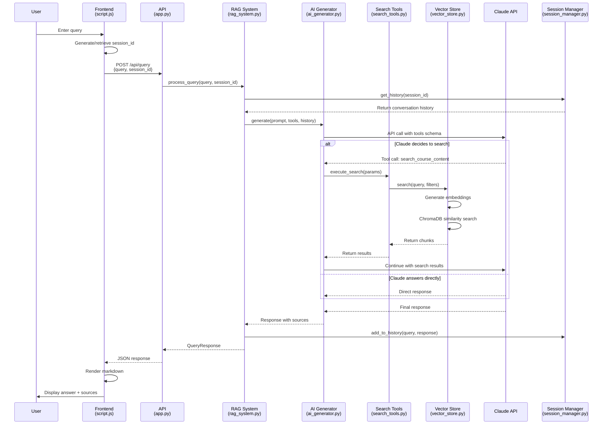
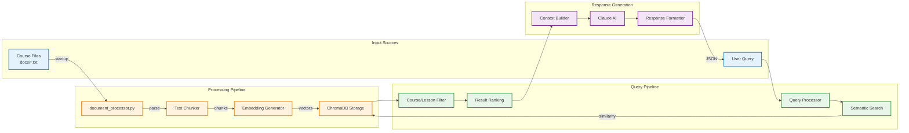
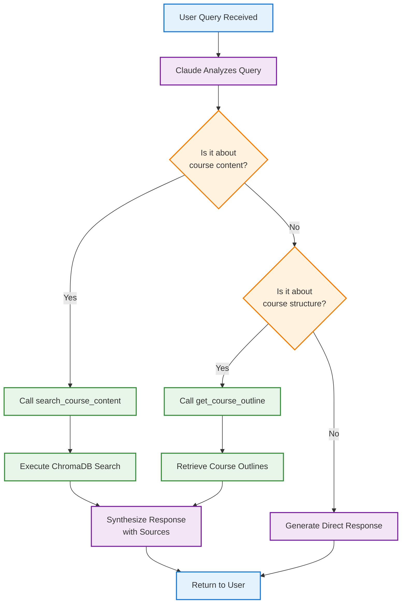
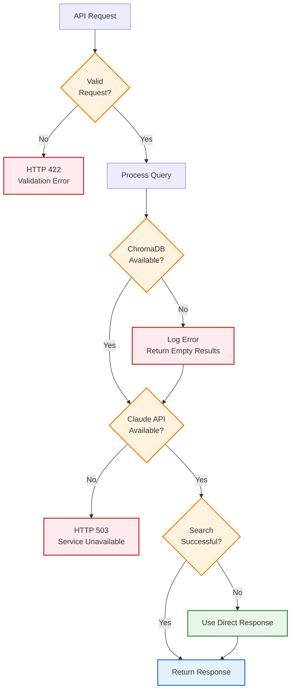
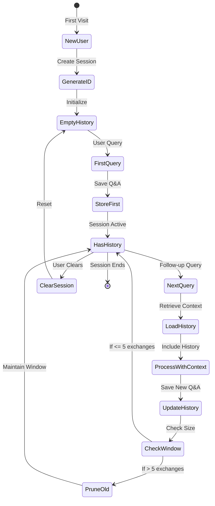
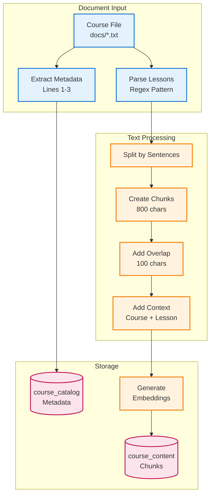
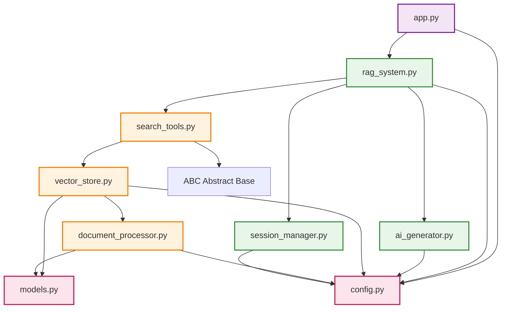
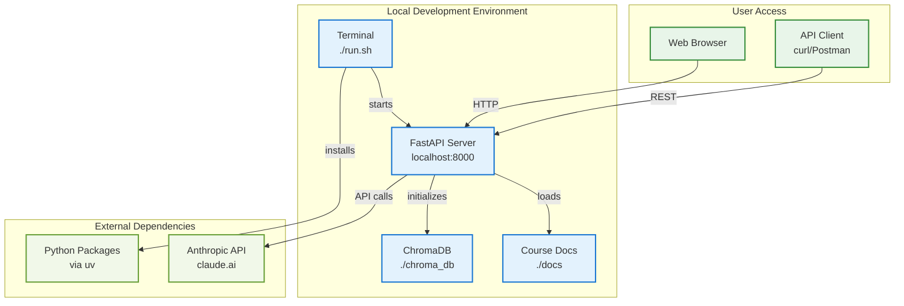

# Query Flow Mermaid Diagrams

## System Architecture Diagram

```mermaid
graph TB
    subgraph "Frontend Layer"
        UI[index.html<br/>User Interface]
        JS[script.js<br/>API Client]
        CSS[style.css<br/>Styling]
    end

    subgraph "Backend API Layer"
        APP[app.py<br/>FastAPI Server]
        RAG[rag_system.py<br/>Query Orchestrator]
    end

    subgraph "Core Processing"
        AI[ai_generator.py<br/>Claude Integration]
        TOOLS[search_tools.py<br/>Search & Outline Tools]
        VECTOR[vector_store.py<br/>ChromaDB Interface]
        DOC[document_processor.py<br/>Text Processing]
        SESSION[session_manager.py<br/>Conversation History]
    end

    subgraph "Data Storage"
        DOCS[(docs/<br/>Course Files)]
        CHROMA[(ChromaDB<br/>Vector Store)]
        SESSIONS[(Session<br/>Memory)]
    end

    subgraph "External Services"
        CLAUDE[Claude API<br/>claude-3-sonnet]
        SBERT[Sentence Transformers<br/>all-MiniLM-L6-v2]
    end

    UI --> JS
    JS --> |HTTP POST /api/query| APP
    APP --> |process_query()| RAG
    RAG --> AI
    RAG --> TOOLS
    RAG --> SESSION
    AI --> |API calls| CLAUDE
    TOOLS --> VECTOR
    VECTOR --> |embeddings| SBERT
    VECTOR --> |search| CHROMA
    DOC --> |process files| DOCS
    DOC --> |store chunks| CHROMA
    SESSION --> SESSIONS
    APP --> |startup| DOC

    classDef frontend fill:#e3f2fd,stroke:#1976d2,stroke-width:2px
    classDef backend fill:#f3e5f5,stroke:#7b1fa2,stroke-width:2px
    classDef ragcore fill:#e8f5e9,stroke:#388e3c,stroke-width:2px
    classDef tools fill:#fff3e0,stroke:#f57c00,stroke-width:2px
    classDef storage fill:#fce4ec,stroke:#c2185b,stroke-width:2px
    classDef external fill:#f1f8e9,stroke:#689f38,stroke-width:2px

    class UI,JS,CSS frontend
    class APP,RAG backend
    class AI,SESSION ragcore
    class TOOLS,VECTOR,DOC tools
    class DOCS,CHROMA,SESSIONS storage
    class CLAUDE,SBERT external
```

## Query Processing Sequence Diagram



## Data Flow Diagram



## Tool Decision Flow



## Error Handling Flow



## Session Management State Diagram



## Document Processing Pipeline



## Component Dependency Graph



## Deployment Architecture



## Legend

### Color Coding
- 🔵 **Blue** (frontend): User interface components
- 🟣 **Purple** (backend): API and server components
- 🟢 **Green** (ragcore): Core RAG system logic
- 🟠 **Orange** (tools): Search and processing tools
- 🩷 **Pink** (storage): Data storage components
- 🟢 **Pale Green** (external): External services

### Diagram Types
1. **System Architecture**: High-level component overview
2. **Sequence Diagram**: Step-by-step query processing
3. **Data Flow**: How data moves through the system
4. **Tool Decision**: Claude's decision-making logic
5. **Error Handling**: Failure recovery paths
6. **Session State**: Conversation management states
7. **Document Pipeline**: Course file processing
8. **Dependencies**: Component relationships
9. **Deployment**: Runtime architecture

## Validation
These diagrams can be validated using:
- **GitHub**: Renders in markdown preview
- **Mermaid Live Editor**: https://mermaid.live/
- **VS Code**: With Mermaid preview extension
- **Command Line**: `npx @mermaid-js/mermaid-cli -i QUERY_FLOW_MERMAID.md -o output.svg`